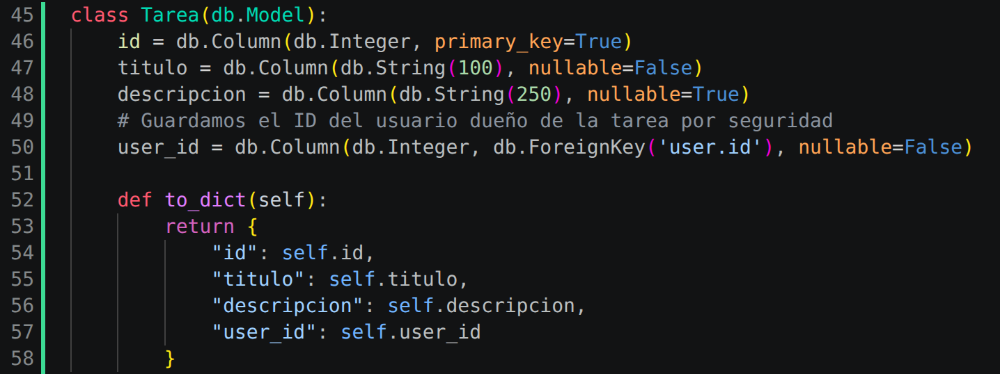
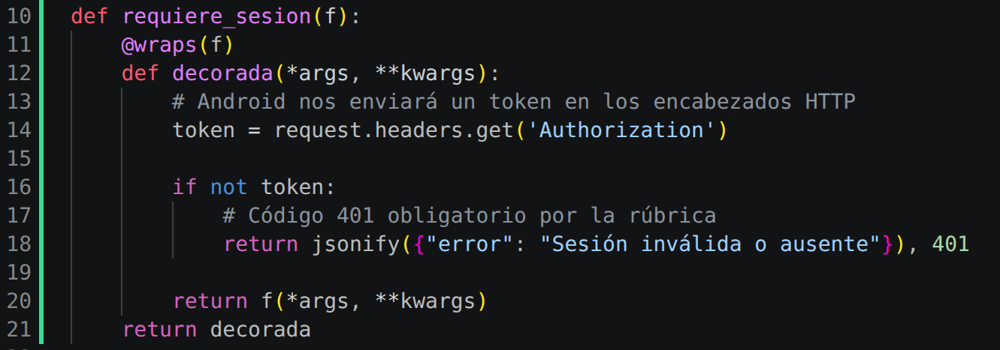
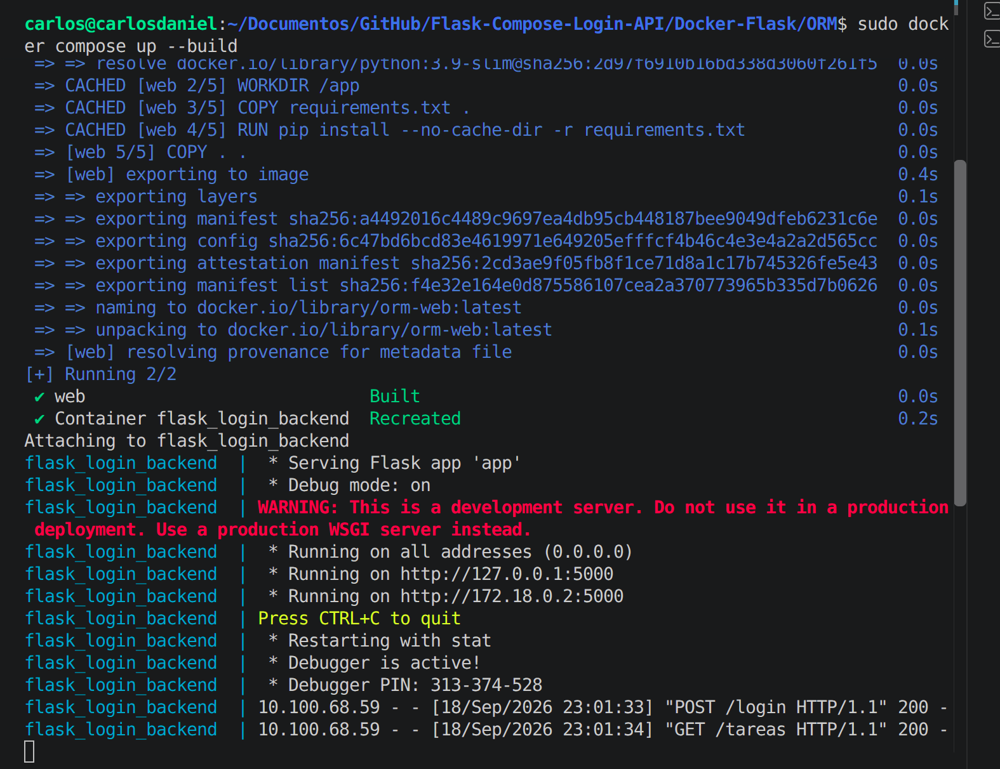
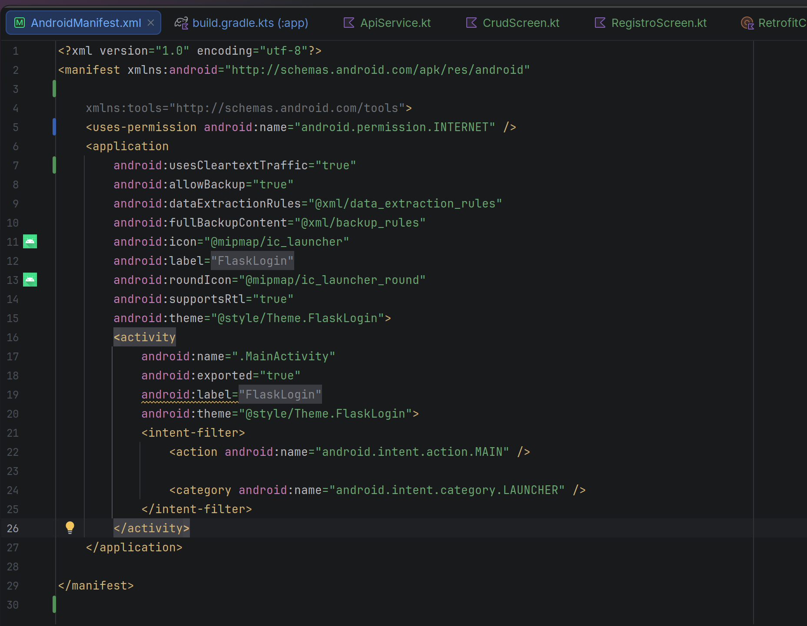
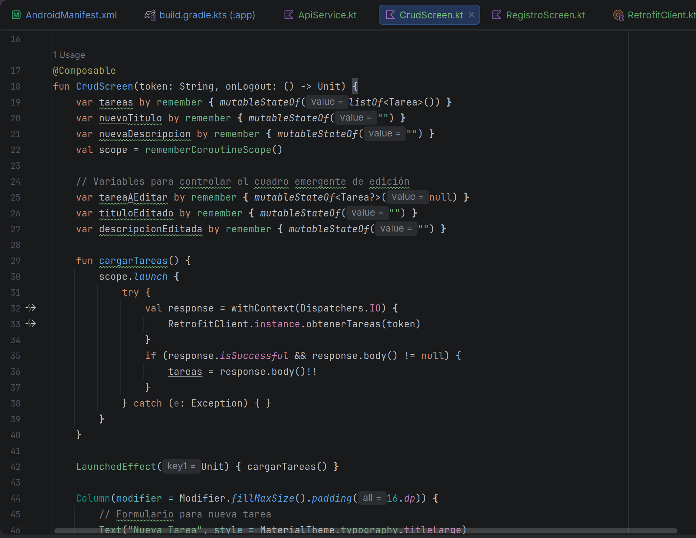
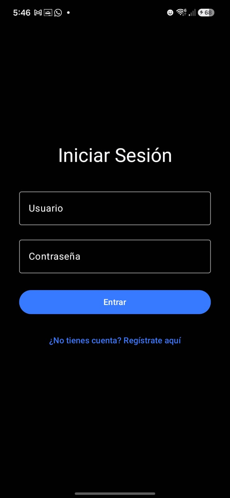
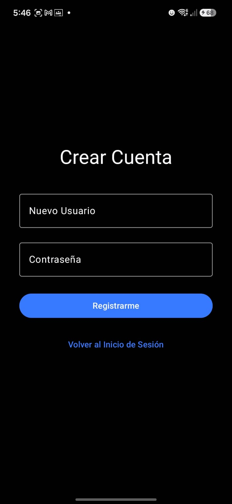
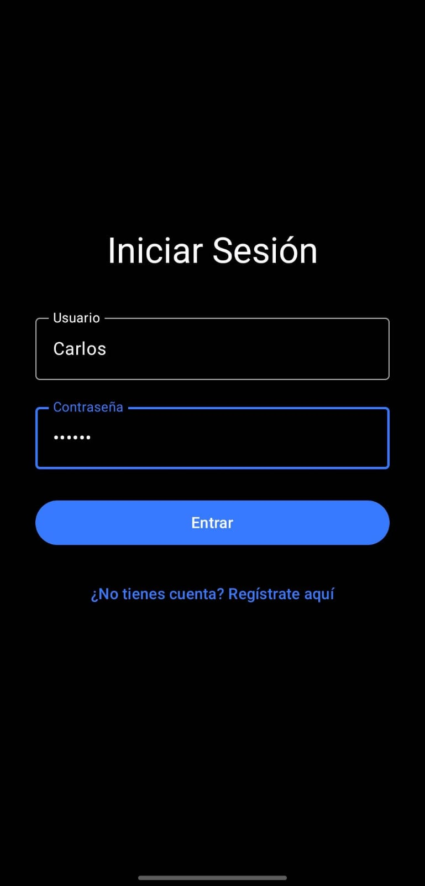
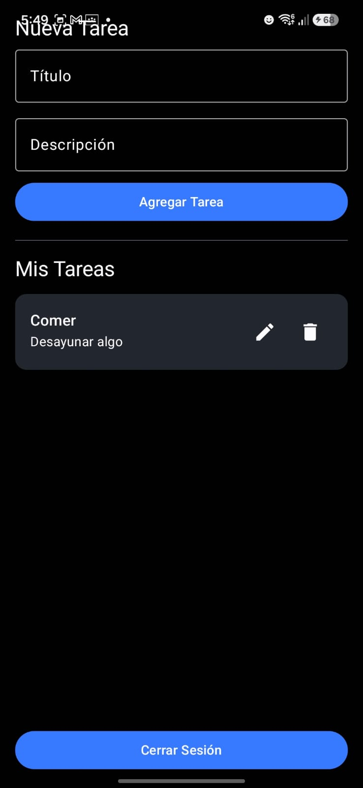
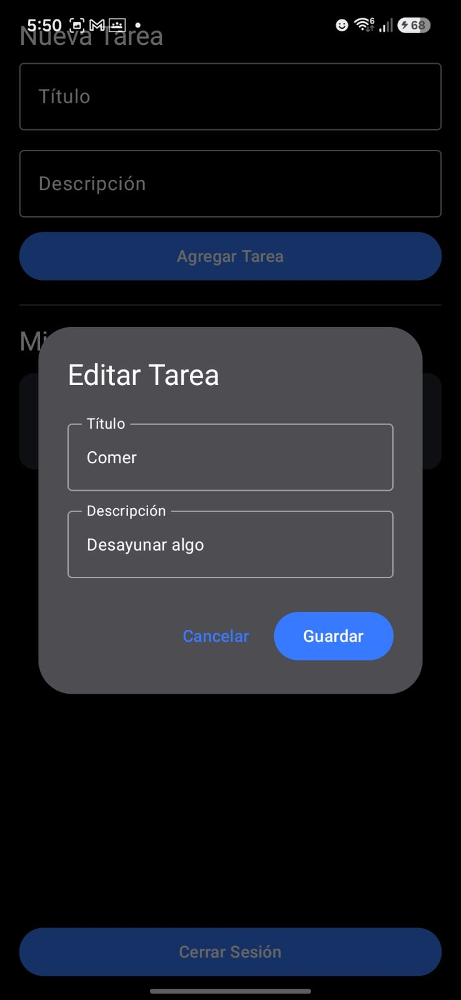

<div align="center">
  
  <!-- Puedes descomentar la siguiente línea para agregar el logo de tu escuela -->
  <!--  -->

  # Práctica 2. "Aplicación Móvil Básica"
  
  ### Desarrollo de Aplicaciones Moviles Nativas

</div>

---

<div align="center">

| Datos del Estudiante | Datos de la Asignatura |
| :--- | :--- |
| **Nombre:** Martinez Martinez Carlos Daniel <br> **Boleta:** 2024630459 <br> **Grupo:** 7CV4 | **Profesor:** Hurtado Aviles Gabrielá <br> **Fecha:** 18/09/2026 |

</div>

# Documentación del Proyecto: Arquitectura Cliente-Servidor con API REST (Flask) y Aplicación Móvil (Android Jetpack Compose)

## 1. Introducción
Este proyecto implementa una arquitectura cliente-servidor completa orientada a microservicios. El sistema está compuesto por un backend desarrollado en Python utilizando el framework **Flask**, y un frontend móvil nativo desarrollado en **Kotlin** utilizando el moderno toolkit declarativo **Jetpack Compose**.

El objetivo principal es gestionar un sistema CRUD (Crear, Leer, Actualizar, Borrar) de Tareas, protegido por un sólido sistema de autenticación y autorización basado en tokens de sesión (JWT - JSON Web Tokens). Todo el entorno del servidor se encuentra contenerizado utilizando **Docker** para garantizar la portabilidad y la independencia del entorno de ejecución.

## 2. Tecnologías y Herramientas Utilizadas

### 2.1. Backend (Servidor)

* **Python 3 & Flask:** Lenguaje y micro-framework base para la construcción ágil de la API RESTful.
* **Flask-SQLAlchemy:** ORM (Object-Relational Mapper) utilizado para interactuar con la base de datos relacional SQLite mediante objetos de Python, evitando la inyección SQL directa.
* **Flask-Bcrypt:** Librería criptográfica utilizada para el hashing (encriptación irreversible) de las contraseñas de los usuarios antes de almacenarlas en la base de datos.
* **itsdangerous:** Módulo utilizado para la generación, firma criptográfica y validación de tokens de sesión con tiempo de expiración (JWT).

### 2.2. Frontend (Cliente Móvil)

* **Kotlin:** Lenguaje principal de desarrollo, elegido por su seguridad contra valores nulos (null-safety) y soporte para corrutinas.
* **Jetpack Compose:** Toolkit moderno de Android para construir interfaces de usuario (UI) de forma declarativa y reactiva, basado en estados mutables (`State`).
* **Retrofit 2 & Gson:** Cliente HTTP typesafe para Android. Retrofit facilita la conversión de la API REST en interfaces de Kotlin, mientras que Gson se encarga de la serialización y deserialización automática de objetos JSON a Data Classes de Kotlin.
* **Corrutinas (Coroutines):** Utilizadas para manejar las peticiones de red (I/O) en hilos secundarios de forma asíncrona, evitando bloquear el hilo principal (Main Thread) de la interfaz de usuario.

### 2.3. Infraestructura y Despliegue

* **Docker & Docker Compose:** Herramientas de contenerización. Permiten encapsular la aplicación Flask, sus dependencias (`requirements.txt`) y su configuración de red interna en un contenedor aislado y reproducible en cualquier máquina host.

## 3. Arquitectura de Red y Conectividad

Uno de los principales retos técnicos de esta implementación es la comunicación entre un dispositivo físico Android y un contenedor Docker ejecutándose en una máquina local.

1. **Exposición del Puerto:** El contenedor de Docker mapea el puerto interno `5000` de Flask al puerto `5000` de la máquina host local.
2. **Red Local (LAN):** El dispositivo Android y la computadora host están conectados a la misma red Wi-Fi. La aplicación móvil está configurada para apuntar a la dirección IP privada del host (`192.168.1.86`) a través de Retrofit.
3. **Configuración de Seguridad en Android:** Dado que la conexión en entorno de desarrollo no cuenta con un certificado SSL (HTTPS), se modificó el archivo `AndroidManifest.xml` habilitando la propiedad `android:usesCleartextTraffic="true"`, permitiendo así el tráfico HTTP en texto plano de forma excepcional.

## 4. Estructura y Seguridad de la API REST

La API cuenta con endpoints públicos y protegidos. La seguridad se implementa mediante un decorador personalizado en Python (`@requiere_sesion`).

### 4.1. Flujo de Autenticación

1. El usuario envía sus credenciales (`/login` o `/register`) en formato JSON.
2. El backend verifica el hash de la contraseña utilizando Bcrypt.
3. Si es correcto, `itsdangerous` genera un token firmado utilizando la `SECRET_KEY` del servidor, inyectando el ID del usuario en el payload del token.
4. El cliente Android recibe y almacena el token en la memoria (`tokenUsuario`).

### 4.2. Endpoints Implementados

* `POST /register`: Registra un nuevo usuario hasheando su contraseña.
* `POST /login`: Autentica al usuario y devuelve un token firmado.
* `GET /tareas`: (Protegido) Devuelve la lista completa de tareas.
* `POST /tareas`: (Protegido) Crea una nueva tarea.
* `PUT /tareas/<id>`: (Protegido) Actualiza el título o descripción de una tarea específica.
* `DELETE /tareas/<id>`: (Protegido) Elimina una tarea de la base de datos.

Para consumir cualquier ruta protegida, Retrofit inyecta automáticamente el token en los encabezados HTTP de la petición: `Authorization: <token>`.

## 5. Diseño de la Interfaz con Jetpack Compose

El frontend adopta un paradigma declarativo. En lugar de manipular las vistas manualmente (como en XML clásico), la interfaz reacciona a los cambios en variables de estado (`mutableStateOf`).

Se diseñó un enrutador principal en `MainActivity.kt` que controla la navegación entre tres pantallas principales basándose en la variable `pantallaActual`:

1. **LoginScreen:** Pantalla inicial con manejo de errores si las credenciales son incorrectas.
2. **RegistroScreen:** Interfaz para crear nuevas credenciales y redirigir al login.
3. **CrudScreen:** El núcleo operativo de la aplicación. Integra:
   * Formularios de texto interactivos para crear tareas.
   * Un componente `LazyColumn` (equivalente moderno del RecyclerView) para renderizar eficientemente listas largas de tareas.
   * Cuadros de diálogo emergentes (`AlertDialog`) que se activan condicionalmente para editar tareas (PUT) sin necesidad de abandonar la pantalla principal.

## 6. Comandos de Despliegue y Ejecución

Para inicializar el entorno backend desde cero en cualquier máquina con Docker instalado, se utilizaron los siguientes comandos en la terminal de Linux:

```bash
# Navegar al directorio del proyecto
cd Documentos/GitHub/Flask-Compose-Login-API/Docker-Flask/ORM

# Construir la imagen de Docker e iniciar el contenedor en segundo plano (forzando reconstrucción)
sudo docker compose up --build
```

Dado que el backend se ejecuta en un contenedor Docker local y no en un servidor público, es necesario actualizar la dirección IP en el código de Android para que la aplicación móvil pueda encontrar el servidor Flask en su propia red.

1. Navegue al archivo `app/src/main/java/ovh/gabrielhuav/flasklogin/RetrofitClient.kt`.
2. Localice la variable `BASE_URL` y modifíquela según el dispositivo en el que vaya a compilar la aplicación:

   * **Si utilizará un Emulador de Android Studio:** 
     Cambie la IP estrictamente a `http://10.0.2.2:5000/` (esta es la ruta estándar que utiliza el emulador de Android para alcanzar el `localhost` de la máquina anfitriona).
   
   * **Si utilizará un Teléfono Físico (Depuración USB):** 
     Asegúrese de que su PC y el teléfono estén en la misma red Wi-Fi. Extraiga su IP local (usando `ipconfig` en Windows o `hostname -I` en Linux) y colóquela con el puerto 5000, por ejemplo: `http://192.168.1.X:5000/`.


## 7. Evidencias del Proceso de Desarrollo (Backend)

Esta sección documenta la construcción del servidor en Python, la validación de la base de datos y la comprobación de la seguridad desde la terminal.

### 7.1. Estructura de la Base de Datos (ORM)
*Captura de `app.py` mostrando la definición de la clase `Tarea` y su relación ForeignKey con la tabla de `User`, asegurando la integridad referencial.*


### 7.2. Implementación de Seguridad JWT (Decorador)
*Captura del código Python donde se define la función `@requiere_sesion`. Este decorador intercepta las peticiones y verifica la existencia y validez del token en los headers.*


### 7.3. Despliegue del Contenedor Docker
*Captura de la terminal de Linux mostrando la ejecución exitosa de `docker compose up --build`. Se observa cómo se descargan los paquetes de Python, se inicializa el servidor Werkzeug y queda a la escucha en el puerto 5000.*



---

## 8. Evidencias del Proceso de Desarrollo (Frontend Android)

Esta sección documenta la configuración del proyecto en Android Studio, la arquitectura de red y la inyección del código Jetpack Compose.

### 8.1. Configuración de Red en AndroidManifest
*Captura del archivo `AndroidManifest.xml` mostrando los dos permisos cruciales para que la aplicación física alcance al contenedor local: `INTERNET` y `usesCleartextTraffic="true"`.*



### 8.2. Cliente HTTP (Retrofit) y Rutas
*Captura de `ApiService.kt` demostrando cómo se mapean las rutas del backend (`@GET`, `@POST`, `@PUT`, `@DELETE`) y cómo se exige el envío dinámico del Token a través del header `Authorization`.*
> **[INSERTE CAPTURA AQUÍ: Android Studio mostrando la interfaz ApiService.kt]**


### 8.3. Arquitectura de UI Declarativa (Jetpack Compose)
*Captura del archivo `CrudScreen.kt` evidenciando el uso de corrutinas (`scope.launch`, `Dispatchers.IO`) para efectuar llamadas a Retrofit sin bloquear el Main Thread, y el uso del bloque `AlertDialog` para la edición de registros.*


---

## 9. Evidencia Visual del Funcionamiento Final (Dispositivo Físico)

Demostración de la aplicación compilada, instalada y conectada al backend vía Wi-Fi local.

### 9.1. Registro e Inicio de Sesión
*Pantallas interactuando con los endpoints `/register` y `/login`. Si el login es exitoso, el servidor despacha un JWT al dispositivo.*




### 9.2. Operaciones de Creación y Lectura (POST & GET)
*Vista principal `CrudScreen`. Muestra el formulario para alimentar la base de datos (POST) y el componente `LazyColumn` renderizando la data viva proveniente del servidor (GET).*




### 9.3. Modificación y Borrado de Datos (PUT & DELETE)
*Se evidencia el uso de los botones interactivos de cada tarjeta. La captura muestra el `AlertDialog` que permite modificar la base de datos (PUT) enviando el ID por el path variable.*


## 8. Conclusiones y Aprendizajes
El desarrollo de este proyecto permitió consolidar los conocimientos en arquitectura Full-Stack y cliente-servidor, abarcando desde la persistencia de datos y seguridad en el backend, hasta el consumo asíncrono de APIs REST en aplicaciones móviles nativas. 

Uno de los mayores retos y aprendizajes técnicos fue la configuración de red para lograr la comunicación efectiva entre un dispositivo Android físico y un contenedor Docker ejecutándose en un entorno local, comprendiendo y superando las barreras del `localhost` tradicional. Asimismo, la implementación de JSON Web Tokens (JWT) reforzó el entendimiento sobre el manejo de autenticación segura y sin estado (stateless).

Por el lado del cliente, la adopción de Jetpack Compose y Kotlin demostró ser un paradigma moderno y altamente eficiente para la creación de interfaces de usuario declarativas, simplificando el manejo de estados visuales dinámicos de forma nativa.


## 9. Referencias Técnicas
* **Android Developers.** (2026). *Jetpack Compose Basics*. Recuperado de la documentación oficial de Android.
* **Pallets Projects.** (2026). *Flask y Flask-SQLAlchemy Documentation*. 
* **Square Open Source.** (2026). *Retrofit 2: A type-safe HTTP client for Android and Java*.
* **Docker Inc.** (2026). *Docker Compose y Networking*. Manual de referencia oficial.
